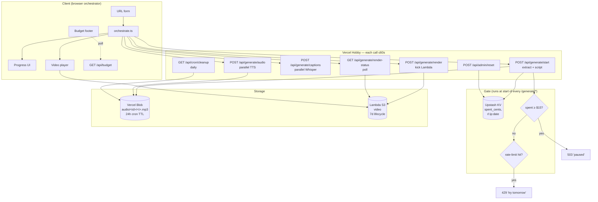

# Reelink

Paste an article URL. Get a 9:16 vertical short-form video with AI voiceover and word-synced TikTok-style captions in under 90 seconds.

Deployed on Vercel Hobby (free tier) with a $15 cumulative-spend kill-switch and a 3-generations/IP/day rate limit.

## Tech stack

- **Next.js 16** — App Router, Turbopack, single deployable
- **Vercel AI SDK** + OpenAI `gpt-4o` (script), `tts-1-hd` voice `nova` (TTS), `whisper-1` (word-level captions)
- **Remotion 4** + **Remotion Lambda** — React-described video rendered on AWS
- **Upstash Redis** (free) — spend counter, rate-limit counters, alert flags
- **Vercel Blob** (free) — per-scene mp3 storage with 24 h cron cleanup
- **AWS S3** — final mp4, 7-day lifecycle
- **shadcn/ui** + Tailwind v4

## Architecture



## Local setup

```bash
pnpm install
cp .env.local.example .env.local      # fill in real values
pnpm dev                              # http://localhost:3000
```

### Required services

1. **OpenAI** — create an API key at platform.openai.com with a small balance (~$10 covers hundreds of generations).
2. **Vercel** — link this repo to a Vercel project (Hobby plan; no upgrade needed). Pull env vars locally with `vercel env pull .env.local`.
3. **Upstash Redis** — free standalone signup at upstash.com (no credit card). Create a Redis database, copy the REST URL + REST Token into `KV_REST_API_URL` and `KV_REST_API_TOKEN`.
4. **AWS** — create an IAM user with Lambda + S3 permissions for Remotion. Then run the one-time Remotion deploy:

```bash
npx remotion lambda functions deploy
npx remotion lambda sites create remotion/index.ts --site-name=reelink

# Set 7-day lifecycle on the bucket Remotion just created:
aws s3api put-bucket-lifecycle-configuration \
  --bucket <bucket-name-from-output> \
  --lifecycle-configuration '{"Rules":[{"ID":"reelink-7d","Status":"Enabled","Filter":{},"Expiration":{"Days":7}}]}'
```

Drop the function name and serve URL from the output into `REMOTION_LAMBDA_FUNCTION_NAME` and `REMOTION_SERVE_URL`.

## Budget guardrails

- Per-generation cost: ~$0.051 (GPT-4o + TTS + Whisper + Lambda).
- Counter is incremented 5¢ per generation in `/api/generate/render` (`lib/budget.ts`).
- At **$10** the system fires a warn-level alert; at **$14** a critical alert; at **$15** every `/api/generate/*` route returns **503** and the submit button locks.
- Rate limit: **3 generations / IP / day** on `/api/generate/start`.
- Reset counter manually: `POST /api/admin/reset` with header `x-admin-token: $ADMIN_RESET_TOKEN`.

## What's NOT in this MVP (Stage 1)

Stage 2 will add per-scene image generation or B-roll, Ken Burns motion, transitions, broader caption styles. Stage 3 adds Vercel Workflow job queue, Neon Postgres history, Clerk auth, optional paid tier. See `/Users/denys/.claude/plans/cosmic-twirling-kurzweil.md` for the full plan.

## License

Private portfolio project. Not for redistribution.
